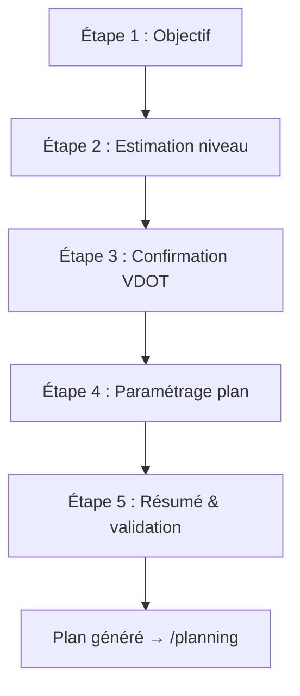

# UX Design — Module Planning V1

**Auteur :** Luka
**Date :** 2026-03-22
**Input :** PRD Planning Module V1, architecture planning, UX design specification Sporty, recherche scientifique

---

## Résumé

Ce document étend le UX Design Specification existant de Sporty pour couvrir les 5 nouvelles surfaces du module Planning, les flows associés et les nouveaux composants. Il s'appuie intégralement sur le design system existant (hybride D1+D2+D5, variante B) et en respecte tous les principes : mobile-first, disclosure progressive, zéro culpabilité, factuel d'abord.

---

## 1. Nouvelles surfaces UX

### Vue d'ensemble de la navigation

```
Bottom Tab Bar (4 onglets existants → 4 onglets)
├── Accueil (dashboard) ← widget "prochaine séance" ajouté
├── Séances (liste + saisie)
├── Planning ← NOUVEAU : plan actif + accès historique
└── Profil ← section "Profil athlète" ajoutée
```

La page `/planning` remplace la notion de "timeline planning" dans l'onglet Accueil. L'onglet Accueil conserve la timeline unifiée mais le widget "prochaine séance" est un raccourci vers `/planning`.

### Routes ajoutées

| Route | Surface | Description |
|-------|---------|-------------|
| `/planning` | Plan actif | Vue semaine du plan en cours (ou CTA si aucun) |
| `/planning/goal` | Goal Setting Wizard | Création d'objectif + onboarding VDOT |
| `/planning/history` | Historique des plans | Liste des plans terminés/abandonnés |
| `/planning/history/:id` | Détail plan archivé | Même vue semaine, lecture seule |
| `/profile/athlete` | Profil athlète | VDOT, zones, état de forme |

---

## 2. Page `/planning` — Plan actif

### 2.1 Structure de la page (mobile)

```
┌─────────────────────────────────┐
│  Header : "Mon plan"            │
│  [Lien "Historique" →]          │
├─────────────────────────────────┤
│  Bandeau objectif               │
│  ┌─────────────────────────────┐│
│  │ 🎯 Semi-marathon 1h50       ││
│  │ 15 juin · Semaine 5/12      ││
│  │ Phase : EQ — Early Quality  ││
│  └─────────────────────────────┘│
├─────────────────────────────────┤
│  Barre de navigation semaines   │
│  ← S4  [S5 ●]  S6 →           │
├─────────────────────────────────┤
│  Résumé semaine                 │
│  Volume : 42 km · 4 séances    │
│  ▓▓▓▓▓▓▓░░░ Charge : normale   │
├─────────────────────────────────┤
│                                 │
│  Lundi ─ Repos                  │
│                                 │
│  Mardi ─ Easy Run               │
│  ┌─────────────────────────────┐│
│  │ 🟢 45 min · Allure E       ││
│  │ 5:30-5:50/km               ││
│  │ ✅ Réalisée · 44min 5:35/km││
│  └─────────────────────────────┘│
│                                 │
│  Mercredi ─ Repos               │
│                                 │
│  Jeudi ─ Intervalles VO₂max     │
│  ┌─────────────────────────────┐│
│  │ 🔴 ~55 min · Zone I        ││
│  │ Échauf 15min E              ││
│  │ 6×800m à 4:10/km           ││
│  │ (récup 400m jog)           ││
│  │ Retour 10min E             ││
│  │ ○ À venir                  ││
│  └─────────────────────────────┘│
│                                 │
│  Samedi ─ Tempo                 │
│  ┌─────────────────────────────┐│
│  │ 🟠 50 min · Zone T         ││
│  │ Échauf 15min E              ││
│  │ 20min à 4:35/km            ││
│  │ Retour 15min E             ││
│  │ ○ À venir                  ││
│  └─────────────────────────────┘│
│                                 │
│  Dimanche ─ Long Run            │
│  ┌─────────────────────────────┐│
│  │ 🟢 1h20 · Allure E         ││
│  │ 5:30-5:50/km               ││
│  │ ○ À venir                  ││
│  └─────────────────────────────┘│
│                                 │
├─────────────────────────────────┤
│  [Toggle] Données techniques    │
│  (phases, VDOT, TSB, ACWR)     │
├─────────────────────────────────┤
│  ⚙️ Recalibration auto ✓       │
│  Allures en min/km | km/h      │
└─────────────────────────────────┘
```

### 2.2 Bandeau objectif

**Composant : `GoalBanner`**

Toujours visible en haut de la page planning. Résume l'objectif et la progression.

| Élément | Détail |
|---------|--------|
| Icône objectif | Cible 🎯 |
| Titre | Distance + temps cible (si défini) — ex: "Semi-marathon 1h50" |
| Sous-titre | Date événement (si définie) + "Semaine X/Y" |
| Phase courante | Label clair : "Base aérobie" (pas "FI" par défaut) |
| Toggle technique | Si activé, affiche aussi le code phase (FI/EQ/TQ/FQ) |

**Labels des phases (mode simple → mode technique) :**

| Code | Label simple | Label technique |
|------|-------------|-----------------|
| FI | Base aérobie | FI — Foundation |
| EQ | Introduction vitesse | EQ — Early Quality |
| TQ | Phase intensive | TQ — Transition Quality |
| FQ | Affûtage | FQ — Final Quality |

### 2.3 Navigation par semaine

**Pattern : Sélecteur horizontal scrollable**

- La semaine courante est centrée et mise en surbrillance (dot bleu plein)
- Swipe horizontal pour naviguer entre les semaines
- Les semaines passées montrent un indicateur de complétion (vert si toutes les séances réalisées, gris sinon)
- La semaine de course (si date événement) est marquée d'une icône drapeau

**Responsive desktop :** Le sélecteur de semaine devient une barre complète avec toutes les semaines visibles (type progress bar segmentée).

### 2.4 Résumé hebdomadaire

**Composant : `WeekSummary`**

Affiché sous le sélecteur de semaine. Donne le contexte immédiat.

- **Volume total** : km prévus (ou réalisés si semaine passée)
- **Nombre de séances** : X séances cette semaine
- **Indicateur de charge** : barre de progression qualitative
  - Vert "Légère" → Bleu "Normale" → Orange "Élevée"
  - Pas de rouge — cohérent avec le principe zéro culpabilité
- **Mode technique (toggle)** : TSB estimé début/fin de semaine, ACWR

### 2.5 Cartes de séance planifiée

**Composant : `PlannedSessionCard`**

Chaque jour de la semaine est listé verticalement. Les jours de repos sont affichés de manière discrète (texte gris, pas de carte).

**Anatomie de la carte :**

```
┌─────────────────────────────────┐
│ [Dot couleur zone] Durée · Zone │
│ Description allure              │
│ (Détail intervalles si qualité) │
│ Statut : ○ À venir / ✅ Réalisée│
└─────────────────────────────────┘
```

**Dot couleur par zone principale :**

| Zone | Couleur | Signification |
|------|---------|---------------|
| E | Vert doux | Endurance, facile |
| M | Bleu | Marathon, modéré |
| T | Orange doux | Tempo, seuil |
| I | Rouge doux | Intervalles, intense |
| R | Violet doux | Répétitions, vitesse |

> Note : ces couleurs de zone sont fonctionnelles et internes à la carte. Elles ne contredisent pas le principe "pas de rouge pour les échecs" — ici le rouge indique l'intensité de la zone, pas un jugement.

**États de la carte :**

| État | Rendu |
|------|-------|
| À venir | Opacité normale, dot vide ○ |
| Aujourd'hui | Bordure accent bleu, label "Aujourd'hui" |
| Réalisée | Dot vert ✅, résultats affichés sous la description (allure réelle, durée réelle) |
| Réalisée avec écart | Résultats + petit indicateur d'écart (ex: "+12s/km" en gris neutre, jamais en rouge) |
| Manquée | Dot gris ○ barré, texte gris. Aucun jugement, juste "Non réalisée" |
| Déplacée | Dot avec flèche, note "Reportée au [jour]" |

**Tap sur une carte → vue détail séance planifiée** (voir section 3).

**Actions (swipe ou menu contextuel) :**
- Marquer comme réalisée (saisie manuelle rapide)
- Déplacer (choisir un autre jour cette semaine)
- Modifier (allure, durée)

### 2.6 Toggle données techniques

Un toggle discret en bas de page (ou dans les paramètres du plan) contrôle l'affichage des infos avancées :

**Mode simple (défaut) :**
- Labels de phase en français clair
- Allures affichées, pas de VDOT
- Pas de TSB/CTL/ATL/ACWR

**Mode technique :**
- Codes de phase (FI/EQ/TQ/FQ)
- VDOT actuel affiché dans le bandeau objectif
- TSB/ACWR dans le résumé hebdomadaire
- % VDOT par zone affiché dans les cartes de séance

### 2.7 Warning ACWR

**Composant : `AcwrWarningBanner`**

S'affiche en bannière au-dessus du résumé hebdomadaire quand ACWR > 1.3.

```
┌─────────────────────────────────┐
│ ⚡ Charge récente élevée        │
│ Ton corps a besoin de récup.   │
│ Les séances suivantes sont     │
│ adaptées.          [Compris ✕] │
└─────────────────────────────────┘
```

**Principes :**
- Fond orange très clair (warning doux)
- Ton bienveillant, factuel — pas "DANGER"
- Dismissable (l'utilisateur peut fermer)
- Aussi affiché sur la carte de séance concernée (petit badge ⚡)
- Mode technique : affiche la valeur ACWR (ex: "ACWR : 1.42")

### 2.8 État vide — Pas de plan actif

Quand `trainingState === 'idle'` et aucun plan actif :

```
┌─────────────────────────────────┐
│                                 │
│         🏃‍♂️                     │
│                                 │
│  Pas de plan en cours           │
│                                 │
│  Définis un objectif pour       │
│  recevoir un plan personnalisé  │
│  adapté à ton niveau.           │
│                                 │
│  [Définir un objectif]  (CTA)   │
│                                 │
│  ──────────────────────         │
│  [Voir les anciens plans →]     │
│                                 │
└─────────────────────────────────┘
```

- CTA principal bleu (bouton primary)
- Lien secondaire vers l'historique en dessous
- Ton encourageant mais pas pushy

### 2.9 Layout desktop

Sur desktop (> 768px) :

```
┌──────────────────────────────────────────────────────┐
│  Sidebar  │  Bandeau objectif                        │
│           ├──────────────────────────────────────────│
│  Accueil  │  Navigation semaines (toutes visibles)   │
│  Séances  ├──────────────┬───────────────────────────│
│ [Planning]│  Séances     │  Panneau latéral          │
│  Profil   │  (grille 2   │  Résumé semaine           │
│           │  colonnes,   │  Charge & métriques       │
│           │  jours       │  (mode tech si activé)    │
│           │  empilés)    │                           │
│           │              │  Lien historique           │
│           │              │  Toggle données tech       │
│           │              │  Recalibration toggle      │
└──────────┴──────────────┴───────────────────────────┘
```

---

## 3. Détail séance planifiée

### 3.1 Vue détail (push navigation)

Quand l'utilisateur tape sur une `PlannedSessionCard`, il arrive sur une vue plein écran.

**Composant : `PlannedSessionDetail`**

```
┌─────────────────────────────────┐
│  ← Retour     [Modifier] [...] │
├─────────────────────────────────┤
│                                 │
│  Jeudi 15 mai                   │
│  Intervalles VO₂max             │
│                                 │
│  ┌─────────────────────────────┐│
│  │ Durée totale : ~55 min     ││
│  │ Zone principale : I        ││
│  │ Allure cible : 4:10/km     ││
│  └─────────────────────────────┘│
│                                 │
│  Détail de la séance            │
│  ┌─────────────────────────────┐│
│  │ 1. Échauffement             ││
│  │    15 min · Allure E        ││
│  │    5:30-5:50/km             ││
│  ├─────────────────────────────┤│
│  │ 2. Travail                  ││
│  │    6 × 800m                 ││
│  │    Allure : 4:10/km         ││
│  │    Récup : 400m jog         ││
│  ├─────────────────────────────┤│
│  │ 3. Retour au calme          ││
│  │    10 min · Allure E        ││
│  │    5:30-5:50/km             ││
│  └─────────────────────────────┘│
│                                 │
│  ── Comparaison (si réalisée) ──│
│  ┌─────────────────────────────┐│
│  │ Prévu        Réalisé        ││
│  │ 55 min       52 min         ││
│  │ 4:10/km      4:05/km        ││
│  │ Zone I       Zone I         ││
│  │              FC moy: 172bpm ││
│  └─────────────────────────────┘│
│                                 │
└─────────────────────────────────┘
```

### 3.2 Bloc intervalles

**Composant : `IntervalBreakdown`**

Représentation visuelle des blocs d'une séance qualité. Chaque bloc est une ligne avec :
- Numéro d'ordre
- Type (échauffement / travail / récupération / retour au calme)
- Durée OU distance
- Allure cible
- Répétitions (si applicable)

**Rendu visuel des types :**

| Type | Style | Icône |
|------|-------|-------|
| Échauffement (warmup) | Fond vert très clair | ↗ |
| Travail (work) | Fond orange/rouge très clair selon zone | ⚡ |
| Récupération (recovery) | Fond gris très clair | ↘ |
| Retour au calme (cooldown) | Fond vert très clair | ↘ |

Les blocs sont empilés verticalement avec un rail de connexion (ligne fine entre les blocs) pour montrer la séquence.

### 3.3 Comparaison prévu vs réalisé

Affiché uniquement quand une séance réalisée est liée (`completedSessionId`). Présentation en deux colonnes côte à côte.

- Les écarts sont affichés en gris neutre
- Aucune couleur rouge, aucun jugement
- Si surperformance notable : petit badge bleu "Au-dessus des attentes" (factuel)
- Si sous-performance : rien de spécial, juste les chiffres

### 3.4 Actions disponibles

| Action | Quand | Comportement |
|--------|-------|-------------|
| Modifier | Séance à venir | Bottom sheet avec champs éditables (allure, durée). La modification est locale au plan |
| Déplacer | Séance à venir | Date picker limité à la même semaine |
| Lier à une séance | Séance à venir | Sélecteur parmi les séances réalisées non liées |
| Saisie rapide | Séance à venir | Formulaire pré-rempli avec les cibles du plan |

---

## 4. Goal Setting Wizard

### 4.1 Flow complet

Le wizard se déclenche quand l'utilisateur clique "Définir un objectif" depuis le CTA de la page planning vide, ou depuis un bouton dans le profil athlète.

**5 étapes maximum, 3 au minimum :**



### 4.2 Étape 1 — Objectif

```
┌─────────────────────────────────┐
│  ← Annuler           Étape 1/5 │
│  ● ○ ○ ○ ○                     │
├─────────────────────────────────┤
│                                 │
│  Quel est ton objectif ?        │
│                                 │
│  Distance                       │
│  ┌───────────────────────┐      │
│  │ [  ] km               │      │
│  └───────────────────────┘      │
│                                 │
│  Raccourcis :                   │
│  [5K] [10K] [Semi] [Marathon]   │
│                                 │
│  Temps cible (optionnel)        │
│  ┌───────────────────────┐      │
│  │ [hh] : [mm] : [ss]   │      │
│  └───────────────────────┘      │
│  "Laisse vide si pas d'objectif │
│   de temps"                     │
│                                 │
│  Date de course (optionnel)     │
│  ┌───────────────────────┐      │
│  │ [Date picker]         │      │
│  └───────────────────────┘      │
│  "Sans date, on calcule une    │
│   durée adaptée à ton niveau"  │
│                                 │
│           [Suivant →]           │
└─────────────────────────────────┘
```

**Détails :**
- Les raccourcis de distance remplissent automatiquement le champ km (5, 10, 21.1, 42.195)
- Distance = seul champ obligatoire
- Bouton Suivant actif dès que la distance est renseignée
- Micro-copy sous chaque champ optionnel pour rassurer

### 4.3 Étape 2 — Estimation du niveau (entonnoir VDOT)

Le contenu de cette étape dépend des données disponibles.

**Cas A : Historique Strava suffisant (≥ 3 séances éligibles)**

L'étape est pré-remplie automatiquement :

```
┌─────────────────────────────────┐
│  ← Retour             Étape 2/5│
│  ● ● ○ ○ ○                     │
├─────────────────────────────────┤
│                                 │
│  Estimation de ton niveau       │
│                                 │
│  ✅ Basée sur tes séances Strava│
│                                 │
│  On a analysé tes 8 dernières   │
│  séances de course. Ton niveau  │
│  estimé :                       │
│                                 │
│        VDOT 42                  │
│  ┌─────────────────────────────┐│
│  │ Semi estimé : ~1h51        ││
│  │ 10K estimé : ~48:30        ││
│  │ Allure E : 5:30-5:50/km    ││
│  └─────────────────────────────┘│
│                                 │
│  Ça te semble juste ?           │
│  [Oui, c'est bon] [Ajuster ±]  │
│                                 │
└─────────────────────────────────┘
```

Si "Ajuster" → slider VDOT ±5 avec mise à jour en temps réel des estimations.

**Cas B : Pas assez de données Strava — Entonnoir 3 niveaux**

```
┌─────────────────────────────────┐
│  ← Retour             Étape 2/5│
│  ● ● ○ ○ ○                     │
├─────────────────────────────────┤
│                                 │
│  Comment estimer ton niveau ?   │
│                                 │
│  Choisis ce qui te correspond : │
│                                 │
│  ┌─────────────────────────────┐│
│  │ 🏁 J'ai un temps récent    ││
│  │ "J'ai couru un 5K, 10K,   ││
│  │  semi ou marathon récemment"││
│  └─────────────────────────────┘│
│                                 │
│  ┌─────────────────────────────┐│
│  │ ⚡ Je connais ma VMA        ││
│  │ "On m'a déjà testé ou je   ││
│  │  connais ma vitesse max"   ││
│  └─────────────────────────────┘│
│                                 │
│  ┌─────────────────────────────┐│
│  │ 🤷 Aucune idée             ││
│  │ "Je débute ou je ne connais ││
│  │  pas ces termes"           ││
│  └─────────────────────────────┘│
│                                 │
└─────────────────────────────────┘
```

**Sous-flow B1 : Temps récent**

```
Distance : [5K ▼]  (dropdown : 5K / 10K / Semi / Marathon)
Temps :    [hh:mm:ss]

→ Calcul VDOT immédiat → Étape 3
```

**Sous-flow B2 : VMA connue**

```
Ma VMA : [    ] km/h

→ Conversion VMA → VDOT → Étape 3
```

Si le profil a déjà une VMA renseignée, la pré-remplir.

**Sous-flow B3 : Questionnaire simplifié**

```
┌─────────────────────────────────┐
│  Quelques questions rapides     │
│                                 │
│  Tu cours combien de fois       │
│  par semaine ?                  │
│  [0-1] [2-3] [4+]              │
│                                 │
│  Depuis combien de temps ?      │
│  [< 3 mois] [3-12 mois] [> 1an]│
│                                 │
│  Tu cours combien de km         │
│  d'habitude ?                   │
│  [< 5 km] [5-10 km] [> 10 km]  │
│                                 │
│         [Estimer →]             │
└─────────────────────────────────┘
```

Les 3 questions sur un seul écran (pas de sous-étapes). Boutons radio visuels. → Mapping vers un VDOT conservateur.

### 4.4 Étape 3 — Confirmation VDOT

Affichée dans tous les cas (Strava, temps, VMA ou questionnaire).

```
┌─────────────────────────────────┐
│  ← Retour             Étape 3/5│
│  ● ● ● ○ ○                     │
├─────────────────────────────────┤
│                                 │
│  Ton profil estimé              │
│                                 │
│  ┌─────────────────────────────┐│
│  │      VDOT 42                ││
│  │                             ││
│  │  Tes zones d'allure :       ││
│  │  E  5:30-5:50/km (facile)  ││
│  │  M  4:55/km (marathon)     ││
│  │  T  4:35/km (seuil)        ││
│  │  I  4:10/km (intervalles)  ││
│  │  R  3:45/km (vitesse)      ││
│  └─────────────────────────────┘│
│                                 │
│  Temps estimés :                │
│  5K: 22:30 · 10K: 48:30        │
│  Semi: 1h51 · Marathon: 3h55   │
│                                 │
│  [─────●─────] Ajuster ±       │
│     38   42   46                │
│                                 │
│  "En cas de doute, mieux vaut  │
│   sous-estimer. Le plan        │
│   s'ajustera vite."            │
│                                 │
│        [Confirmer →]            │
└─────────────────────────────────┘
```

**Détails :**
- Slider de ±5 VDOT pour ajustement fin
- Toutes les valeurs se mettent à jour en temps réel au slide
- Message rassurant en bas : le VDOT initial n'a pas besoin d'être parfait
- Les allures sont affichées dans l'unité préférée de l'utilisateur

### 4.5 Étape 4 — Paramétrage du plan

```
┌─────────────────────────────────┐
│  ← Retour             Étape 4/5│
│  ● ● ● ● ○                     │
├─────────────────────────────────┤
│                                 │
│  Personnalise ton plan          │
│                                 │
│  Séances par semaine            │
│  [3] [4] [5]  ← recommandé: 4  │
│                                 │
│  Jours préférés                 │
│  L  [M] [Me] J  [V] S  [D]     │
│  (pré-cochés, modifiables)      │
│                                 │
│  Durée du plan                  │
│  ┌───────────────────────┐      │
│  │ 12 semaines           │      │
│  └───────────────────────┘      │
│  "Recommandé pour ton profil.  │
│   Minimum 8 semaines."         │
│                                 │
│  ou                             │
│  [Tout par défaut — générer]    │
│                                 │
│           [Suivant →]           │
└─────────────────────────────────┘
```

**Détails :**
- Séances/semaine : boutons radio. La recommandation est basée sur le niveau (débutant → 3, intermédiaire → 4, avancé → 4-5)
- Jours préférés : chips toggle (max = nombre de séances choisies). Pré-remplis intelligemment (mardi, jeudi, samedi, dimanche pour 4 séances)
- Durée : pré-remplie selon la table distance × niveau du PRD. Warning si l'utilisateur réduit sous 8 semaines
- Si date d'événement définie à l'étape 1, la durée est calculée automatiquement et verrouillée (avec indication "Calculé d'après ta date de course")
- Le bouton "Tout par défaut" permet de skip cette étape entièrement

### 4.6 Étape 5 — Résumé & validation

```
┌─────────────────────────────────┐
│  ← Retour             Étape 5/5│
│  ● ● ● ● ●                     │
├─────────────────────────────────┤
│                                 │
│  Ton plan est prêt              │
│                                 │
│  ┌─────────────────────────────┐│
│  │ 🎯 Semi-marathon 1h50       ││
│  │ 15 juin 2026                ││
│  │                             ││
│  │ VDOT : 42                   ││
│  │ 12 semaines · 4 séances/sem ││
│  │ Du 24 mars au 15 juin       ││
│  │                             ││
│  │ Phase 1 : Base (3 sem)      ││
│  │ Phase 2 : Vitesse (3 sem)   ││
│  │ Phase 3 : Intensive (3 sem) ││
│  │ Phase 4 : Affûtage (3 sem)  ││
│  └─────────────────────────────┘│
│                                 │
│  La recalibration automatique   │
│  est activée par défaut.        │
│  Le plan s'adaptera à tes      │
│  séances réelles.               │
│                                 │
│      [Générer mon plan]         │
│                                 │
└─────────────────────────────────┘
```

- Le CTA "Générer mon plan" lance la génération
- Loading state : spinner + "Génération en cours..."
- Après génération → redirect vers `/planning` avec le plan actif
- Toast : "Plan créé ! Bonne préparation 💪"

---

## 5. Widget Dashboard — Prochaine séance

### 5.1 Intégration dans le dashboard existant

Le widget s'insère dans la timeline unifiée existante, entre les quick stats et la timeline des séances passées.

**Composant : `NextSessionWidget`**

```
┌─────────────────────────────────┐
│  Prochaine séance               │
│  ┌─────────────────────────────┐│
│  │ Demain · Mardi              ││
│  │ Intervalles VO₂max · ~55min ││
│  │ 6×800m à 4:10/km           ││
│  │                    [Voir →] ││
│  └─────────────────────────────┘│
└─────────────────────────────────┘
```

**États :**

| État | Rendu |
|------|-------|
| Plan actif, séance à venir | Carte avec résumé de la prochaine séance |
| Plan actif, séance aujourd'hui | Mise en avant : bordure bleu, "Aujourd'hui" en label |
| Plan actif, jour de repos | "Repos aujourd'hui. Prochaine séance : jeudi" |
| Pas de plan actif | Pas de widget affiché |
| Plan terminé | "Plan terminé ! [Voir les options →]" |

**Tap sur le widget** → navigation vers `/planning` avec focus sur la semaine courante.

---

## 6. Profil athlète

### 6.1 Page `/profile/athlete`

Accessible depuis l'onglet Profil (nouvelle section). Regroupe les données liées au planning.

```
┌─────────────────────────────────┐
│  ← Profil                       │
│  Mon profil athlète              │
├─────────────────────────────────┤
│                                 │
│  Niveau estimé                   │
│  ┌─────────────────────────────┐│
│  │        VDOT 42              ││
│  │  (Mis à jour le 15 mai)    ││
│  │        [Modifier]           ││
│  └─────────────────────────────┘│
│                                 │
│  Zones d'allure                 │
│  ┌─────────────────────────────┐│
│  │ E   5:30 - 5:50 /km        ││
│  │ M   4:55 /km               ││
│  │ T   4:35 /km               ││
│  │ I   4:10 /km               ││
│  │ R   3:45 /km               ││
│  └─────────────────────────────┘│
│                                 │
│  État d'entraînement            │
│  ┌─────────────────────────────┐│
│  │ Statut : En préparation     ││
│  │ Plan : Semi 1h50            ││
│  │ Semaine 5/12                ││
│  └─────────────────────────────┘│
│                                 │
│  ── Données techniques ──       │
│  (visible si toggle activé)     │
│  ┌─────────────────────────────┐│
│  │ CTL : 45  (forme)           ││
│  │ ATL : 52  (fatigue)         ││
│  │ TSB : -7  (frais neutre)   ││
│  │ ACWR : 1.15 (optimal ✓)    ││
│  └─────────────────────────────┘│
│                                 │
│  Informations personnelles      │
│  ┌─────────────────────────────┐│
│  │ Sexe : [Non renseigné ▼]   ││
│  │ FC max : 185 bpm            ││
│  │ FC repos : 58 bpm           ││
│  │ VMA : 15.5 km/h             ││
│  └─────────────────────────────┘│
│                                 │
└─────────────────────────────────┘
```

**Détails :**
- VDOT affiché en grand (style display)
- "Modifier" le VDOT → slider ±5 comme dans le wizard
- Les zones sont en lecture seule (dérivées du VDOT)
- Les données techniques sont cachées par défaut, visibles via le même toggle global
- Les infos personnelles (sexe, FC) sont éditables inline
- Le champ sexe est un dropdown optionnel (Homme / Femme / Non renseigné). Le label est neutre : "Sexe (pour le calcul de charge)"

---

## 7. Page `/planning/history` — Historique des plans

### 7.1 Liste des anciens plans

```
┌─────────────────────────────────┐
│  ← Planning                     │
│  Historique des plans            │
├─────────────────────────────────┤
│                                 │
│  ┌─────────────────────────────┐│
│  │ 🎯 10K en 48min             ││
│  │ Jan — Mars 2026 · 12 sem   ││
│  │ ✅ Terminé · VDOT 40 → 42  ││
│  │ 38/48 séances réalisées    ││
│  └─────────────────────────────┘│
│                                 │
│  ┌─────────────────────────────┐│
│  │ 🎯 5K                       ││
│  │ Oct — Déc 2025 · 8 sem     ││
│  │ ○ Abandonné (semaine 5)    ││
│  │ 12/20 séances réalisées    ││
│  └─────────────────────────────┘│
│                                 │
│  (Liste vide : "Pas encore     │
│   de plan terminé")            │
│                                 │
└─────────────────────────────────┘
```

**Composant : `PlanHistoryCard`**

| Élément | Détail |
|---------|--------|
| Icône | 🎯 |
| Titre | Distance + temps cible |
| Période | Dates début-fin + durée en semaines |
| Statut | ✅ Terminé (vert) / ○ Abandonné (gris neutre) |
| Progression VDOT | VDOT début → fin (si changement) |
| Complétion | X/Y séances réalisées |

**Tap sur une carte** → `/planning/history/:id` — même vue semaine que le plan actif, mais en lecture seule. Header indique "Plan terminé" ou "Plan abandonné". Aucune action d'édition disponible.

### 7.2 Vue détail plan archivé

Identique à la vue `/planning` (section 2) avec les différences :
- **Lecture seule** : pas de swipe actions, pas de bouton modifier
- **Toutes les semaines sont "passées"** : dots verts ou gris selon complétion
- **Header** : "Plan terminé — 10K en 48min" avec badge statut
- **Pas de bandeau ACWR** ni de toggle recalibration

---

## 8. Flows transversaux

### 8.1 Recalibration — Feedback utilisateur

Après chaque séance importée (Strava ou saisie manuelle), si le plan a la recalibration auto activée :

**Cas 1 : Ajustement mineur (±10-20%)**
- Silencieux. Les allures sont ajustées sans notification.
- Si l'utilisateur consulte le plan, les allures reflètent les nouvelles valeurs.
- Pas de toast, pas de bannière.

**Cas 2 : Réévaluation VDOT à la hausse**
- Toast informatif : "Belles performances ! Ton VDOT passe de 42 à 43. Les allures sont ajustées."
- Durée : 5 secondes, non bloquant
- Visible aussi dans le profil athlète (VDOT mis à jour)

**Cas 3 : Proposition de réévaluation à la baisse**
- Dialog non bloquant sur la page planning :

```
┌─────────────────────────────────┐
│  Ajustement suggéré             │
│                                 │
│  Tes 3 dernières séances sont   │
│  en dessous des cibles. On peut │
│  ajuster les allures pour       │
│  mieux coller à ta forme        │
│  actuelle.                      │
│                                 │
│  VDOT 42 → 40                   │
│                                 │
│  [Ajuster]    [Garder tel quel] │
└─────────────────────────────────┘
```

- Ton neutre, factuel. Pas de "tu es moins bon"
- L'utilisateur décide toujours

**Cas 4 : Inactivité > 14 jours**
- Bannière en haut de la page planning :

```
┌─────────────────────────────────┐
│  Tu n'as pas couru depuis       │
│  2 semaines.                    │
│                                 │
│  [Reprendre le plan]            │
│  [Nouveau plan]                 │
│  [Plus tard]                    │
└─────────────────────────────────┘
```

### 8.2 Post-plan — Transitions

Quand un plan atteint son terme (`status: completed`) :

```
┌─────────────────────────────────┐
│                                 │
│  🎉 Plan terminé !              │
│                                 │
│  Bravo pour ces 12 semaines.    │
│  Qu'est-ce que tu veux faire    │
│  maintenant ?                   │
│                                 │
│  ┌─────────────────────────────┐│
│  │ 🔄 Phase de transition      ││
│  │ 2-3 semaines de récup      ││
│  │ progressive                ││
│  └─────────────────────────────┘│
│                                 │
│  ┌─────────────────────────────┐│
│  │ 🔁 Plan de maintien         ││
│  │ Garder la forme en          ││
│  │ attendant un nouvel objectif││
│  └─────────────────────────────┘│
│                                 │
│  ┌─────────────────────────────┐│
│  │ 🎯 Nouvel objectif          ││
│  │ Définir une nouvelle course ││
│  └─────────────────────────────┘│
│                                 │
│  [Plus tard]                    │
│                                 │
└─────────────────────────────────┘
```

Cet écran remplace le contenu de `/planning` quand le plan est terminé. "Plus tard" ramène à l'état vide avec CTA.

Quand la transition est terminée, même pattern → proposition maintien ou nouvel objectif.

---

## 9. Nouveaux composants

### Résumé des composants à créer

| Composant | Usage | Priorité |
|-----------|-------|----------|
| `GoalBanner` | Bandeau objectif en haut de /planning | Épique 2 |
| `WeekSelector` | Navigation horizontale entre semaines | Épique 3 |
| `WeekSummary` | Résumé de la semaine (volume, charge) | Épique 3 |
| `PlannedSessionCard` | Carte de séance planifiée (vue semaine) | Épique 3 |
| `PlannedSessionDetail` | Vue détail plein écran d'une séance | Épique 3 |
| `IntervalBreakdown` | Détail des blocs d'intervalles | Épique 3 |
| `ComparisonBlock` | Prévu vs réalisé côte à côte | Épique 3 |
| `GoalSettingWizard` | Wizard 5 étapes (objectif + VDOT + plan) | Épique 1-2 |
| `VdotEstimator` | Entonnoir 3 niveaux d'estimation | Épique 1 |
| `VdotConfirmation` | Slider de confirmation/ajustement VDOT | Épique 1 |
| `PaceZonesDisplay` | Tableau des 5 zones d'allure | Épique 1 |
| `NextSessionWidget` | Widget prochaine séance sur dashboard | Épique 3 |
| `AthleteProfile` | Page profil athlète complète | Épique 1 |
| `FitnessMetrics` | CTL/ATL/TSB/ACWR (mode technique) | Épique 1 |
| `AcwrWarningBanner` | Bannière de warning ACWR | Épique 4 |
| `PlanHistoryCard` | Carte résumé d'un ancien plan | Épique 3 |
| `PostPlanProposal` | Écran de choix post-plan | Épique 5 |
| `RecalibrationDialog` | Dialog de réévaluation VDOT à la baisse | Épique 4 |
| `InactivityBanner` | Bannière de reprise après inactivité | Épique 4 |

### Relation avec les composants existants

Les nouveaux composants réutilisent :
- **Card** (shadcn) → base de toutes les cartes
- **Button** → CTA, actions
- **Dialog/Sheet** → wizards, modales
- **Toggle** → mode technique, recalibration
- **Toast** → feedbacks de recalibration
- **Tabs** → éventuel onglet plan actif/historique (non retenu, lien à la place)
- **Skeleton** → loading des données de plan

---

## 10. Responsive — Synthèse

| Surface | Mobile | Desktop |
|---------|--------|---------|
| `/planning` | Colonne unique, semaines en swipe | Grille 2 colonnes + panneau latéral |
| Séance planifiée | Push plein écran | Modale large ou panneau droit |
| Goal Setting Wizard | Plein écran, 1 étape par écran | Modale centrée large, mêmes étapes |
| Profil athlète | Colonne unique | Grille 2 colonnes |
| Historique | Liste verticale | Grille 2 colonnes de cards |
| Post-plan proposal | Plein écran | Modale centrée |

---

## 11. Principes UX spécifiques au planning

1. **Le plan propose, l'utilisateur dispose** — Aucune transition automatique. Le système suggère, le coureur décide.

2. **Lisibilité avant exhaustivité** — Les séances sont décrites en langage clair ("45 min facile") avec le détail technique à un tap de profondeur.

3. **Labels simples par défaut** — "Base aérobie" plutôt que "FI". Le jargon est optionnel via toggle.

4. **Couleurs de zone ≠ couleurs de jugement** — Le rouge sur une zone I indique l'intensité, pas un problème. Les "problèmes" sont en orange doux ou gris.

5. **La recalibration est invisible sauf événement notable** — Ajustements mineurs silencieux. Seuls les changements de VDOT méritent une notification.

6. **L'historique est une fierté** — Les anciens plans montrent la progression (VDOT début → fin). C'est un journal d'accomplissement, pas un rappel d'échecs.

7. **Le débutant ne doit jamais être perdu** — Le questionnaire simplifié, les labels clairs et le slider de VDOT avec estimations en temps réel garantissent la compréhension même sans connaissance technique.
